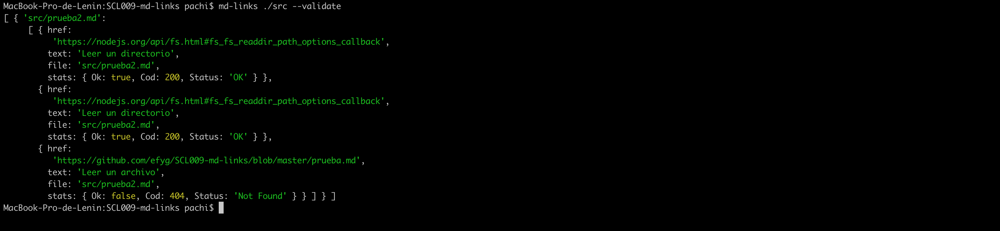
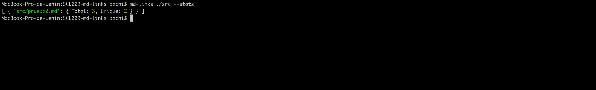
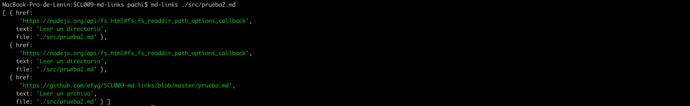
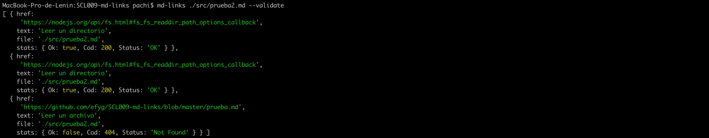
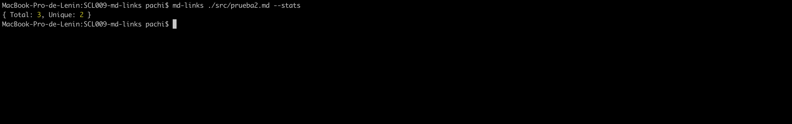

# mdLinks


## Introducción

mdLinks es un paquete analizador de url's que puede acceder a diferentes rutas especificadas por el usuario, y puede leer el contenido tanto de archivos como de directorios para entregar la información que contiene cada uno (links). 


### Instalación

Para instalar el módulo mdLinks se debe ejecutar el siguiente comando en la terminal: 
```js
    npm install mdLinks
```

### Uso

#### Comandos

####Leer un directorio
```js
    mdLinks directory
```
##### Retorna: 


<br>


```js
    mdLinks directory --validate
```
##### Retorna: 


<br>

```js
    mdLinks directory --stats
```
##### Retorna: 


<br>


```js
    mdLinks directory --validate --stats
```
##### Retorna: 


<br>

####Leer un Archivo
```js
    mdLinks file
```
##### Retorna: 


<br>

```js
    mdLinks file--validate
```
##### Retorna: 


<br>

```js
    mdLinks file --stats
```
##### Retorna: 


<br>

```js
    mdLinks file --validate --stats
```
##### Retorna: 


## Versión
* Versión: 0.1.0


## Dependencias
* node: v8.11.4
* npm: v6.9.0
* node-fetch: "^1.0.0"
* filehound: "^1.17.0",
* marked: "^0.6.2",
